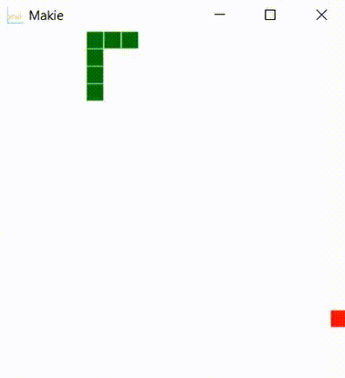

# Snake.jl
This is the classic snake game implemented using the Julia programming language. I used [makie.jl](http://makie.juliaplots.org/stable/) for the graphics aspect of this project. The idea of using scatter plots was inspired by [this thread](https://github.com/JuliaGL/GLFW.jl/issues/162). Also, [this page](https://makie.juliaplots.org/dev/interaction.html) helped me figure out how to take realtime keyboard input.

